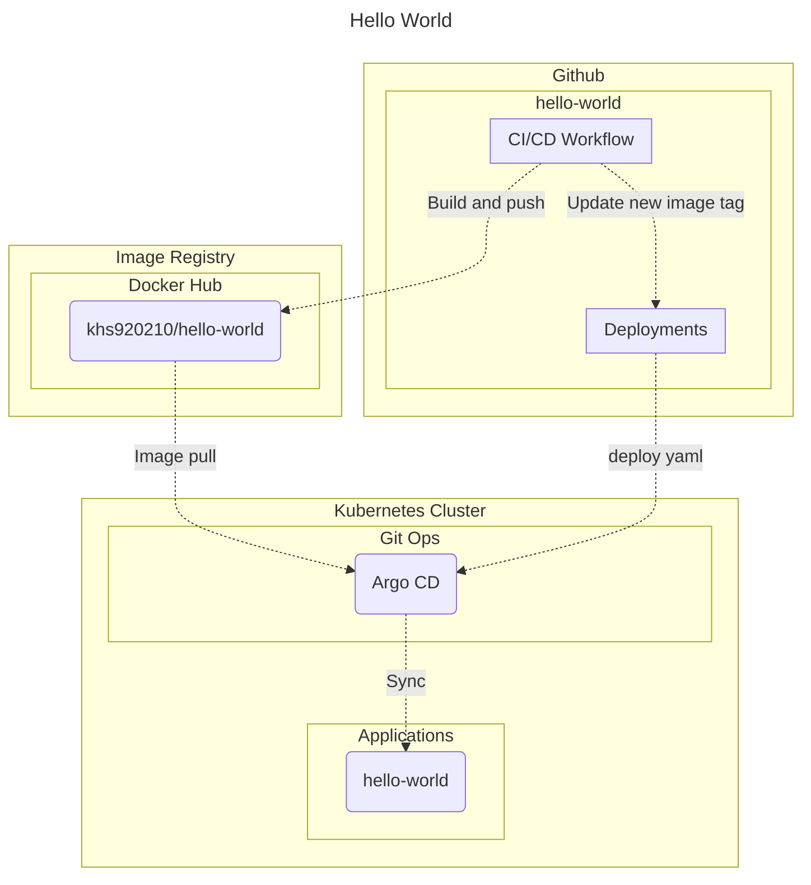

# Hello World Application

| Links                                                                                                    |
|----------------------------------------------------------------------------------------------------------|  
| [khs920210/hello-world](https://hub.docker.com/r/khs920210/hello-world/tags)                             |  
| [Deployments](https://github.com/kimheonseung/hello-world/blob/main/deploy/manifest/deployment.yaml#L26)    |
| [Workflows](https://github.com/kimheonseung/hello-world/blob/main/.github/workflows/ci-cd-hello-world.yaml) |